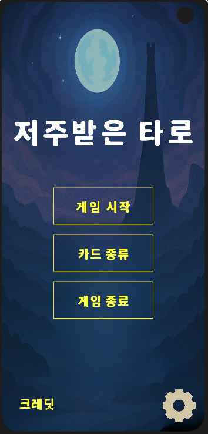
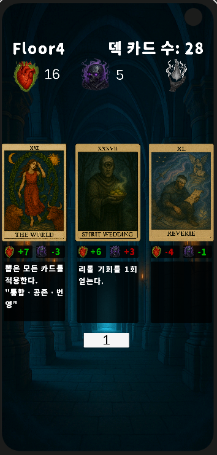

# 🃏 OSSW 팀 프로젝트 기획안 - 저주받은 타로

---

## 📌 프로젝트 개요

- **프로젝트 분류**: 게임 개발
- **게임 이름**: 저주받은 타로
- **장르**: 싱글플레이 전략 턴제 카드게임
- **플랫폼**: 모바일 Android
- **팀원 수**: 5명
- **개발 기간**: 약 10주

---

## 🌌 저주받은 타로

### 🧠 게임 배경 스토리

깊고 깊은 곳, 인간의 발길이 닿지 않은 울창한 숲 한가운데.
하늘 끝까지 솟은 검은 탑이 고요하게 홀로 서 있다.

그 주위엔 안개가 짙게 깔려 있으며, 나뭇잎 사이로 스며드는 빛조차 꿈결처럼 흐릿하다.
어딘가에서 들려오는 작고 낮은 속삭임과 숲의 숨결은, 이 곳을 한없이 몽환적이고 스산한 기운으로 물들인다.
탑은 시간조차 잊은 채 존재해왔으며, 그 안에는 **저주받은 타로**라 불리는 금단의 힘이 잠들어 있다.
그리고 탑 끝에 다다르는 자는, 그 금단의 힘을 자신의 것으로 만들 것이라 전해진다.
탑의 각 층은 현실과 꿈의 경계가 일그러진 세계로 이루어져 있고, 그곳에 발을 들인 자는 탑이 내리는 시련을 통해 저주받은 타로의 정체를 마주하게 될 것이다.
시련은 그에서 선택을 강요하며 탑을 오를수록 점점 더 깊고, 농밀하게 이들을 갉아먹고 잠식시킨다.
그리고 마침내, 선택의 무게가 그의 운명을 결정짓게 될 것이다.
이제, 당신은 천천히, 조심스럽게 탑의 문을 밀고 들어선다.
심장은 조용히 두근대고, 손끝은 미세하게 떨린다.
이 곳에서의 모든 선택은 오직 당신의 것이며, 모든 대가는 반드시 돌아온다.

### 🎯 게임 목표

- **목표 턴(40턴)** 동안 생존

### ⚙️ 게임 기본 자원

| 자원명 | 초기값 | 설명 |
| --- | --- | --- |
| 체력 (HP) | 10 | 매 턴 저주 수치만큼 피해. 0이 되면 즉시 게임 종료 |
| 저주 (Curse) | 0 | 5턴마다 자동 +1. 카드 효과에 따라 증감 가능 |
| 카드 덱 | 40장 | 매 턴 3장 랜덤 등장. 카드 효과로 추가/삭제 가능 |

### 🔁 턴 진행 방식

매 턴마다 다음의 순서로 진행된다.

1. **카드 뽑기**: 기본 3장의 카드를 덱에서 드로우
2. **카드 선택**: 1장을 선택
3. **효과 실행**: 일반 효과 즉시 실행, 특수 효과 존재 시 문구에 맞게 실행
4. **저주 피해**: 턴 종료 시 체력 -= 현재 저주
5. **저주 증가**: 매 5턴마다 `턴/5` 만큼 저주 증가
6. **죽음 카드 삽입**: 저주 ≥ 6 → 매 턴 `저주 - 5` 장의 죽음 카드가 덱에 추가됨

### 🃏 카드 효과 예시

| 카드 | 일반 효과 | 특수 효과 |
| --- | --- | --- |
| 🌞 태양 | 체력 +10 / 저주 +2 |  |
| 🌙 달 | 체력 -10 / 저주 -2 |  |
| ⭐ 별 | 체력 +2 |  |
| ☠ 죽음 |  | 사망한다. |
| 🗼 탑 | 체력 -1 | 다음 턴은 카드를 뽑지 않고 저주로 인한 체력감소가 이루어지지 않는다. |
| 👥 연인 | 체력 +1 / 저주 +1 | 리롤 기회를 1회 얻는다. |
| 🌍 세계 | 체력 +7/ 저주 -3 | 뽑은 모든 카드를 적용한다. |

  **☑️카드 이미지는 본 문서 하단 참고**

### 🖼️ 게임 UI 미리보기

 &nbsp;&nbsp;&nbsp;&nbsp;&nbsp;&nbsp;&nbsp;&nbsp; 

---

### 👥 팀 정보

| **팀명** | 청룡오형제 |
| --- | --- |
| **팀원** | 배태현 (20185412)  김태우 (20192317) 송민석 (20194526) 정어진 (20185810) 가오즈항 (20196837) |

---

## 🛠️ 개발 환경

- **게임 엔진**: Unity 6000.1.2f1
- **IDE**: Visual Studio Code
- **개발 언어**: C#
- **버전 관리**: Git & GitHub
- **협업 도구**: Discord, Notion
- **AI 도구**: ChatGPT-4

---

## 🗃️ 카드 및 기타 이미지

| 0 | 1 | 2 | 3 | 4 |
|--|--|--|--|--|
|  |  |  |  |  |

| 5 | 6 | 7 | 8 | 9 |
|--|--|--|--|--|
|  |  |  |  |  |

| 10 | 11 | 12 | 13 | 14 |
|----|----|----|----|----|
|  |  |  |  |  |

| 15 | 16 | 17 | 18 | 19 |
|----|----|----|----|----|
|  |  |  |  |  |

| 20 | 21 | 22 | 23 | 24 |
|----|----|----|----|----|
|  |  |  |  |  |

| 25 | 26 | 27 | 28 | 29 |
|----|----|----|----|----|
|  |  |  |  |  |

| 30 | 31 | 32 | 33 | 34 |
|----|----|----|----|----|
|  |  |  |  |  |

| 35 | 36 | 37 | 38 | 39 |
|----|----|----|----|----|
|  |  |  |  |  |

| 40 | main | Start | Floor |   |
|----|---|---|---|---|
|  |  |  |  |  |

---

### 👥 개발 담당
게임 로직

배태현

카드별 체력, 저주 수치 적용

카드별 특수 효과 적용

카드 드로우 기능

직업 기능

카드 덱 기능

가오즈항

카드 자동 추출 시스템 구현

게임 로직 설계 및 최적화

무한모드 추가

카드별 스토리 추가

UI/UX

김태우

카드 이미지(40장) 제작

UI 연결(카드 이미지, 카드 효과, 카드 스토리)

메인 메뉴 구성(텍스트, 버튼)

인게임 화면 구성(HP, 저주 표시, 카드 위치, 턴 표시)

송민석

게임 UI 이미지 제작 및 비율 조정

카드 드로우 애니메이션 추가

게임 엔딩 장면 연동

크레딧 화면

카드 종류 탭(초기 설정)

설계 및 문서화

정어진

게임 시스템 설계 및 기획

게임 초기 CLI 버전 개발

문서화

발표

UI 개선

게임 로직 버그 수정

카드 효과 제작
