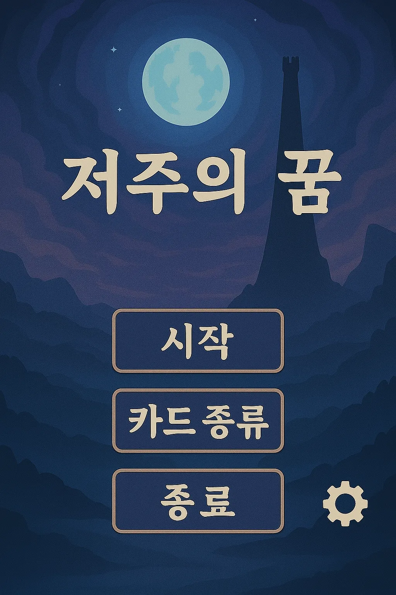

# 🌌 저주받은 타로: 타워 오브 페이트

> 깊고 깊은 숲 속, 잊혀진 검은 탑의 시련이 당신을 기다립니다.

## 👥 팀 정보

| 항목     | 내용 |
|----------|------|
| **팀원**   |배태현 (20185412)  김태우 (20192317) 송민석 (20194526) 정어진 (20185810) 가오즈항 (20196837) |

## 🧠 게임 소개

인간의 발길이 닿지 않은 숲 한가운데, 고요히 솟아오른 검은 탑이 있습니다. 안개 속에 숨겨진 이 탑 안에는, 금단의 힘 **“저주받은 타로”**가 잠들어 있습니다.  
플레이어는 탑의 시련 속에서 **타로 카드를 통해 생존을 도모하고, 저주를 관리하며**, 점차 무너지는 정신과 육체를 붙잡아야 합니다.  
**40턴 동안 생존**하는 것이 유일한 목표이자, 유일한 희망입니다.

---

## 🖼️ 게임 UI 미리보기

> 메인 타이틀 화면 – "저주의 꿈"

---

## 🎯 게임 목표

- **목표 턴(40턴)** 동안 생존
- 타로 카드를 이용해 **체력과 저주**를 관리
- **덱 조작 및 전략적 선택**으로 점점 강화되는 시련을 극복

---

## ⚙️ 게임 기본 자원

| 자원명    | 초기값 | 설명                                     |
|---------|------|----------------------------------------|
| 체력 (HP) | 10   | 매 턴 저주 수치만큼 피해. 0이 되면 즉시 게임 종료     |
| 저주 (Curse) | 0   | 5턴마다 자동 +1. 카드 효과에 따라 증감 가능          |
| 카드 덱    | 40장  | 매 턴 3장 랜덤 등장. 카드 효과로 추가/삭제 가능       |

---

## 🔁 턴 진행 방식

1. **카드 뽑기**: 기본 3장의 카드가 랜덤 등장  
2. **카드 선택**: 1장을 선택  
3. **효과 실행**: 카드의 효과 즉시 적용 (HP/저주/덱 변화)  
4. **저주 피해**: 턴 종료 시 HP -= 현재 저주 수치  
5. **저주 증가**: 매 5턴마다 자동으로 +1  
6. **죽음 카드 삽입**: 저주 ≥ 6 → 매 턴 `저주 - 5` 장의 죽음 카드가 덱에 추가됨  

---

## 🃏 카드 유형

### ① 생존형 카드
- 예시: 태양, 성배, 부활, 불씨  
- **효과**: 체력 회복, 죽음 카드 제거 등  

### ② 정화형 카드
- 예시: 고탑, 심판, 여제, 마법사  
- **효과**: 저주 수치 감소, 죽음 카드 제거  

### ③ 조작형 카드
- 예시: 별, 연인, 세계, 거울  
- **효과**: 카드 수 변화, 다음 턴 영향, 효과 복제 등  

### ④ 고위험 고보상 카드
- 예시: 악마, 황제, 운명의 수레바퀴  
- **효과**: 체력 대량 회복 vs 저주 대폭 증가  

### ⑤ 덱 조정형 카드
- 예시: 지팡이, 생명, 봉인 등  
- **효과**: 카드 추가/삭제/덱 재편  

---

## ⛓️ 저주 압박 시스템

- **5턴마다 저주 +1** (회피 불가)
- **저주 ≥ 6일 때**, 매 턴 [저주 - 5]장의 죽음 카드 삽입
- 시간이 지날수록 **덱이 오염**되고, 생존 난이도 급상승

---

## ⏳ 카드 효과 타입

| 타입     | 설명                                               |
|--------|--------------------------------------------------|
| 즉시형   | 선택 시 즉시 발동                                     |
| 지연형   | 일정 턴 후 발동 (예: 3턴 후 저주 -3)                   |
| 조건형   | 특정 조건 만족 시 발동 (예: HP 1 이하일 때 부활)        |

---

## 🧠 핵심 전략 포인트

- **저주 6 이상 절대 금지**: 죽음 카드가 쌓이면 치명적  
- **덱 정리 우선**: 죽음 카드 삽입 전 불필요 카드 정리  
- **카드 연계 사용**: `거울 + 세계` 조합 등 폭발적 효과 가능  
- **장기 플랜 필수**: 지연형 카드 활용 위한 턴별 추적 필요  
- **고위험 카드는 타이밍 중요**: 체력 여유 있을 때 `악마`, `황제` 활용

---

## 🏁 결말 시스템

| 생존 턴        | 저주 조건     | 결말 유형             |
|--------------|------------|---------------------|
| 1~9턴         | 무관         | 통제불능의 영혼          |
| 10~19턴       | 저주 ≥ 10   | 심연으로 추락           |
| 10~19턴       | 저주 < 10   | 생존자                |
| 20턴 이상      | 무관         | 운명 파괴자            |

---

## 📜 라이선스

## 카드 이미지

| 0 | 1 | 2 | 3 | 4 |
|--|--|--|--|--|
|  |  |  |  |  |

| 5 | 6 | 7 | 8 | 9 |
|--|--|--|--|--|
|  |  |  |  |  |

| 10 | 11 | 12 | 13 | 14 |
|----|----|----|----|----|
|  |  |  |  |  |

| 15 | 16 | 17 | 18 | 19 |
|----|----|----|----|----|
|  |  |  |  |  |

| 20 | 21 | 22 | 23 | 24 |
|----|----|----|----|----|
|  |  |  |  |  |

| 25 | 26 | 27 | 28 | 29 |
|----|----|----|----|----|
|  |  |  |  |  |

| 30 | 31 | 32 | 33 | 34 |
|----|----|----|----|----|
|  |  |  |  |  |

| 35 | 36 | 37 | 38 | 39 |
|----|----|----|----|----|
|  |  |  |  |  |

| 40 |   |   |   |   |
|----|---|---|---|---|
|  |  |  |  |  |

